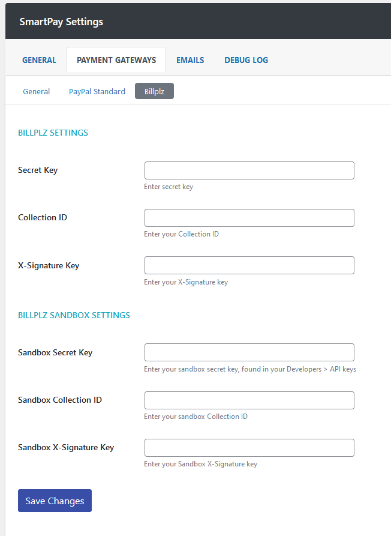
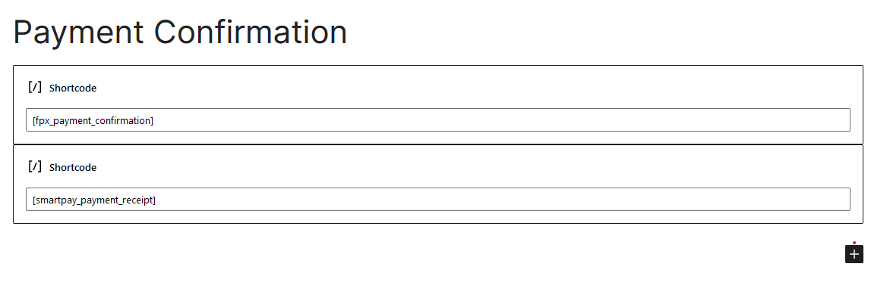

# FPX Payment Integration for WPSmartPay (Beta Version)

## Accept payment by using Financial Process Exchange (FPX) gateway.

### Description:
[WPSmartPay](https://wordpress.org/plugins/smartpay) is a WordPress plugin that simplifies the way to sell digital downloads and accept payments to run your business online.

FPX Payment Integration for WPSmartPay plugin adds support for Malaysia's local payment gateway so that you can sell your product or set up payment forms with Billplz, ToyyibPay, QlicknPay and among others. **(Currently this plugin only support Billplz)**.

### Current status:
**THIS PLUGIN IS CURRENTLY IN BETA**. *Not suitable for live use cases just yet. Use Sandbox account to test. Please report any bugs in the GitHub issues so that I can sort it out. Any feedbacks is highly appreciated.*

### Setup process:
1. Install and activate [WPSmartPay](https://wordpress.org/plugins/smartpay).
2. Install and activate [FPX Payment Integration for WPSmartPay]() plugin.
3. In WordPress admin, go to `SmartPay > Settings > Payment Gateways` and tick the Billplz checkbox and click `Save Changes`. Proceed to Billplz tab and enter your payment gateway API key details. *(For now only Billplz is available).*

4. Go to `Page` menu and edit the `Payment Confirmation` page, which is the default WPSmartPay's payment confirmation page. Add this shortcode: `[fpx_payment_confirmation]` above the existing shortcode in the page.

### Changelog:
**0.0.1-beta1 [ April 19, 2022]**
* *Initial beta release*

